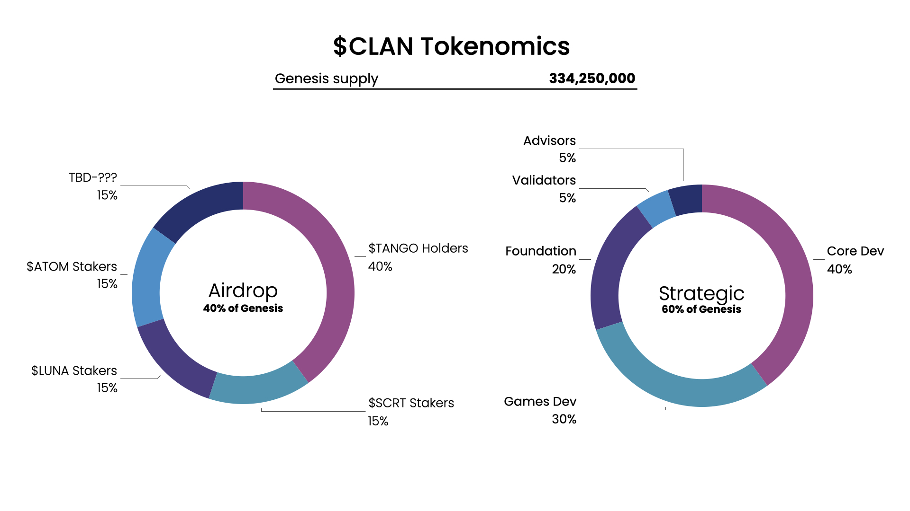
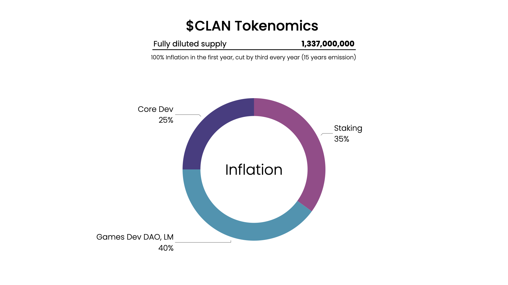
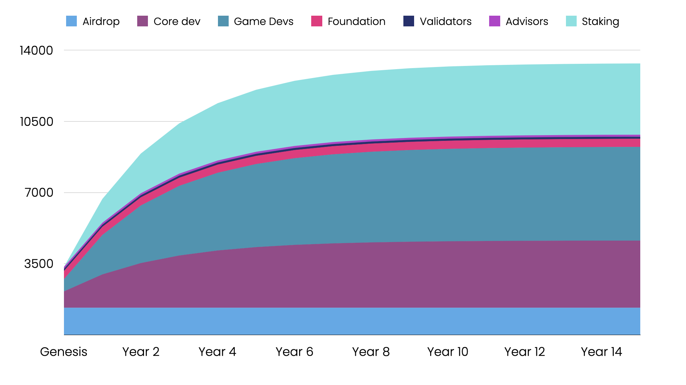

# Tokenomics

In the spirit of Web3, Clan Network is a community-led project to the utmost degree. Accordingly, the distribution of the network’s native token, $CLAN, is designed to reward the most active contributors by default: Game devs, network core devs and validators.

In contrast to existing gaming-oriented chains such as Solana, Polygon, Wax, and Flow, when games and apps developers contribute to Clan, they receive partial ownership over the network. Clan is not run by a centralized dev shop, rather, it is a community-led project, where contributors are compensated with ownership.

We designed the tokenomics to incentivize active participation and contribution. We believe that this model allows for rapid improvement and can attract top talent and ecosystem players to Clan over other, more centralized networks. Finally, we believe that this model aligns well with Cosmos, web3, and web3 gaming ethos.

**The function of $CLAN**

$CLAN carries a variety of use cases within Clan Network’s ecosystem, including securing the proof of stake network, on-chain governance & using as gas for all interoperable smart contracts deployed in the ecosystem.

**$CLAN tokenomics design**

The critical token design decisions we describe below were inspired by recent network launches on Cosmos: Osmosis, Stargaze and Juno. (1) We decided to airdrop 40% of $CLAN's genesis supply from day 1, this is in line with our aspiration to make Clan Network truly decentralized and community-led from day one. (2) We choose to airdrop to $ATOM, $SCRT, and $LUNA stakers to attract Cosmos communities that have a strong, active developer and NFT communities and potential technical integrations with Clan Network. (3) We set the initial inflation rate to 100%, with yearly thirding, to strongly incentivize active, ongoing contribution to the network. (4) Almost all of the remaining tokens are going to (a) core contributors of the network - not just the founding team, others are encouraged to participate (b) game developers - we offer game devs to be true partners, through partial ownership of the network (c) validators - to secure the network, and in the future, to offer interchain security for game developers that would want to build their own Cosmos zones.

**Genesis distribution plan- 334,250,000 $CLAN**

The Genesis distribution consists of two main buckets: (1) **Airdrop** and (2) **Strategic**.

(1) Airdrop includes:

* 40%- $TANGO Holders
* 15%- $SCRT Stakers
* 15%- $ATOM stakers
* 15%- $LUNA Stakers
* 15%- ???- TBD through DAO voting action

The airdrop will take place in June, distributing $CLAN to $TANGO holders and $SCRT, ATOM & $LUNA stakers. After this initial distribution, Clan Network’s first voting action will be to decide upon an additional Cosmos chain (TBD-???) to be included in $CLAN’s airdrop!&#x20;

The amount of $CLAN distributed is relative with whale caps installed to ensure a wide, fair distribution and minimums put in place to prevent ‘dust accounts’ that will dilute the airdrop. More details about the airdrop including the claim process, minimum and whale cap, snapshot and eligibility details will be described in a separate dedicated Airdrop article.

As noted above, one of the main goals of the airdrop is to attract active Cosmos NFT, gaming and development communities. We aim to establish a solid technical community that is hardwired to Cosmos’s multichain future grand vision.

(2) The Strategic distribution goal is to drive the growth of the project, and includes:

* 40%- Core network development- Designed to bootstrap Clan Network’s infrastructure development
* 30%- Game developers scholarships- Designed to incentivize game developers to build Web3 games on Clan Network
* 20%- Foundation reserve- Marketing, operations, contractors
* 5%- Validators- Incentives for genesis validators
* 5%- Advisors

**Inflation distribution plan- 1,337,000,000 $CLAN over 15 years**

$CLAN’s inflation is designed to:

1. Incentivize game developers to build Web3 games on Clan Network’s hub
2. Incentivize Cosmos native developers to contribute to the core development of Clan Network
3. Incentivize $CLAN holders to secure the network by validating or delegating

Thus, the inflation of $CLAN consists of:

* 40% Game development DAO- Designed to drive Clan Network’s game development.
* 25% Core Network development- Designed to drive Clan Network’s infrastructure development. Governed by contributors committee.
* 35% Staking rewards

The inflation phase of $CLAN is spread across 15 years, starting with inflation of 100% in the first year, and decreasing by third every year thereafter. The inflation can be adjusted via governance action, as we believe the values might be optimized as the network develops.

